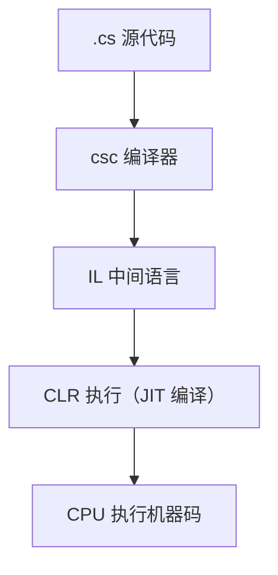

#  
# [C# ] 编程语言全解：起源、设计理念、语法技巧与实战应用
 
 

> *“C# 是强大而现代的语言，融合了 C++ 的高性能与 Java 的简洁稳定。”*

---

## 🧬 1. C# 的起源与创造者

C#（发音 "C sharp"）是由微软公司于 2000 年推出的现代化编程语言，由**Anders Hejlsberg** 主导开发（他也是 Turbo Pascal 和 Delphi 的作者）。

### 🎯 目标：
打造一门适用于**Windows 平台、Web 应用、企业开发**的新一代语言，集成于微软的 .NET 平台之中。

---

## 💡 2. 设计理念与语言特色

| 特性             | 描述                                           |
|------------------|------------------------------------------------|
| 面向对象         | 支持封装、继承、多态                         |
| 类型安全         | 静态类型检查 + Nullable 类型                  |
| 自动内存管理     | 内置垃圾回收机制（GC）                       |
| 异常处理机制     | `try-catch-finally` 块保障程序稳定运行       |
| 现代语法糖       | 支持 Lambda、LINQ、异步编程、模式匹配等     |
| 跨平台能力       | 借助 .NET Core / .NET 6+，可运行于 Linux、macOS、Windows

---

## ⚙️ 3. 底层逻辑：C# 如何运行？

C# 属于托管语言，依赖 .NET 运行时。

### 🧱 执行流程：



### 🔧 CLR（Common Language Runtime）作用：

- 类型安全验证
- 垃圾回收与内存管理
- 异常处理机制
- 安全性与权限控制

---

## ✍️ 4. 基础语法与开发技巧

### 🚀 Hello World

```csharp
using System;

class Program {
    static void Main() {
        Console.WriteLine("Hello, C#!");
    }
}
```

### 🔥 常见语法技巧

#### ✅ Lambda 表达式

```csharp
Func<int, int, int> add = (a, b) => a + b;
```

#### ✅ LINQ 查询语法

```csharp
var evens = numbers.Where(n => n % 2 == 0).ToList();
```

#### ✅ 异步编程

```csharp
async Task<string> GetDataAsync() {
    var response = await httpClient.GetStringAsync(url);
    return response;
}
```

#### ✅ 模式匹配

```csharp
if (obj is string s && s.Length > 0)
    Console.WriteLine(s);
```

---

## 🧩 5. 应用场景广泛

| 场景             | 框架或技术栈                      |
|------------------|-----------------------------------|
| Web 后端开发     | ASP.NET Core、Web API             |
| 桌面应用         | WPF、WinForms、MAUI               |
| 游戏开发         | Unity（C# 是主要脚本语言）        |
| 云平台服务       | Azure Functions、.NET on AWS      |
| 移动开发         | Xamarin / MAUI                    |
| 跨平台工具       | CLI 工具、桌面工具（跨系统）       |

---

## 🏁 6. C# 的优势总结

| 优点             | 说明                             |
|------------------|----------------------------------|
| 微软生态支持     | 与 Windows、Azure 无缝集成       |
| 开发效率高       | 语法现代，工具链强大              |
| 跨平台能力提升   | .NET Core/.NET 6+ 完善了 Linux 支持 |
| 企业友好         | 适合大规模系统和敏捷开发         |

---

## 📚 7. 入门建议与学习资源

| 资源                     | 说明                          |
|--------------------------|-------------------------------|
| [C# 官方文档](https://learn.microsoft.com/dotnet/csharp/) | 微软权威教程                   |
| 《C# 9.0 in a Nutshell》 | 深入全面                      |
| [DotNetFiddle](https://dotnetfiddle.net/) | 在线编写运行 C# 程序          |
| [Unity Learn](https://learn.unity.com/) | 游戏开发专用 C# 入门平台       |

---

## ✅ 总结一句话

> **C# 是一门优雅、现代、强大的语言，尤其适合企业开发、跨平台项目与游戏开发，是微软生态中的重要支柱。**

---

👏 如果你喜欢本篇内容，欢迎收藏、分享，也可以留言告诉我是否希望出《ASP.NET Core 入门实践》《Unity 游戏开发指南》《C# 面向对象设计模式》等实战系列！

```
 