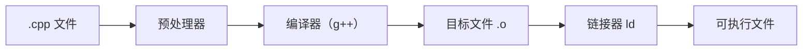

#  
# [C++] 编程语言全解：起源、设计理念、底层逻辑与实战技巧
 


> *“C++ 不只是编程语言，更是通向高性能与系统控制的大门。”*

---

## 🧬 1. 起源：C++ 是怎么来的？

- **创始人：** Bjarne Stroustrup（丹麦计算机科学家）
- **诞生时间：** 1979 年（最初为 "C with Classes"）
- **首次发布：** 1985 年命名为 C++

### 🏗 初衷：
> 在不牺牲性能的前提下，为 C 语言引入面向对象编程（OOP）能力。

---

## 💡 2. C++ 的设计理念与语言特色

| 特性               | 描述                                                             |
|--------------------|------------------------------------------------------------------|
| 面向对象 + 泛型    | 支持类、继承、封装、多态，模板支持泛型编程                      |
| 高性能             | 接近硬件级别控制，适用于系统底层开发                            |
| 静态强类型         | 编译期类型检查，避免运行时错误                                   |
| RAII 资源管理      | 构造 + 析构自动管理资源（智能指针等）                           |
| 向后兼容 C         | 可直接调用 C 函数库、系统接口                                   |
| 编译型语言         | 源代码通过编译器转换为机器代码，提高执行效率                    |

---

## ⚙️ 3. 底层逻辑简析：C++ 是如何运行的？

C++ 是一门**编译型语言**，源代码需要经过编译过程转成机器码才能运行。



### 🚀 编译过程关键阶段：

1. **预处理**：处理 `#include`、`#define` 等宏
2. **编译**：转为中间汇编代码
3. **汇编**：生成 `.o` 文件（目标文件）
4. **链接**：整合库文件，生成可执行程序

---

## ✍️ 4. 基础语法与开发技巧

### ✅ Hello World

```cpp
#include <iostream>
using namespace std;

int main() {
    cout << "Hello, C++!" << endl;
    return 0;
}
```

### ✅ 类与对象

```cpp
class Car {
public:
    string brand;
    Car(string b) : brand(b) {}
    void honk() { cout << brand << " says beep!" << endl; }
};
```

### ✅ 模板函数（泛型）

```cpp
template <typename T>
T add(T a, T b) {
    return a + b;
}
```

### ✅ 智能指针（C++11）

```cpp
#include <memory>
unique_ptr<int> ptr(new int(5));
```

### ✅ Lambda 表达式（C++11+）

```cpp
auto sum = [](int a, int b) { return a + b; };
```

---

## 🧠 5. C++ 常见陷阱与实用技巧

| 技巧                           | 说明                                           |
|--------------------------------|------------------------------------------------|
| 避免裸指针使用                 | 使用 `std::shared_ptr` / `unique_ptr` 管理内存 |
| 熟练使用 STL（标准模板库）    | 如：`vector`、`map`、`algorithm`               |
| RAII 模式                     | 构造时申请资源，析构时自动释放                |
| 善用 const、引用、值传递差异   | 提升代码安全与性能                            |
| 多态用虚函数实现              | 使用 `virtual` 关键字支持运行时动态分发       |

---

## 🧩 6. C++ 的应用场景

C++ 在性能要求高或资源受限的场景中无可替代。

| 应用领域         | 说明                                 |
|------------------|--------------------------------------|
| 操作系统开发     | Linux、Windows 内核部分采用 C/C++     |
| 嵌入式系统       | IoT、芯片驱动程序                     |
| 游戏开发         | Unreal Engine、Unity 底层使用 C++     |
| 金融高频交易系统 | 要求低延迟、高吞吐，C++ 是首选         |
| 图形引擎         | OpenGL、DirectX、图形渲染管线          |
| 浏览器内核       | Chromium、Firefox 均基于 C++          |

---

## 🔧 7. C++ 标准演进（现代化之路）

| 标准版本 | 特性亮点                        |
|----------|----------------------------------|
| C++98    | 初版标准，基础面向对象支持       |
| C++11    | Lambda、智能指针、auto 类型推断  |
| C++14    | 语法简化、泛型增强               |
| C++17    | 结构化绑定、文件系统库           |
| C++20    | 协程（coroutines）、模块化        |
| C++23    | 扩展 constexpr、增强模板编程支持 |

---

## 📚 8. 学习资源推荐

| 类型       | 资源名称                                       |
|------------|------------------------------------------------|
| 官方文档   | [C++ Reference](https://en.cppreference.com/)  |
| 入门课程   | B站《C++ 教程》、《小甲鱼 C++》               |
| 实战书籍   | 《C++ Primer》《Effective C++》               |
| 编程练习   | [LeetCode](https://leetcode.cn)、[Codeforces](https://codeforces.com/) |
| 编译器工具 | GCC / Clang / MSVC                             |

---

## ✅ 总结一句话

> **C++ 是一门“能做一切”的语言，适合构建高性能、底层控制与工程规模兼具的大型系统。**

---

## 🎯 初学者项目建议

- 实现一个命令行计算器
- 编写文件读写和日志系统
- 使用 STL 构建图算法（如 Dijkstra）
- 制作小游戏（如贪吃蛇）
- 利用 SFML/SDL 实现图形渲染

---

👏 如果你喜欢本篇内容，欢迎收藏、分享，也可以留言告诉我是否希望继续推出《C++ STL 全解》《设计模式与 C++ 实战》《现代 C++ 开发项目》等进阶系列！
 
---