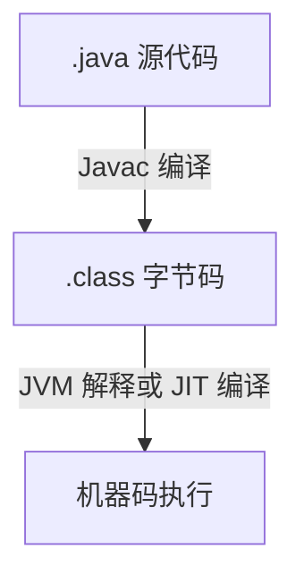

# Java 编程语言全解：起源、核心机制、开发技巧与实战应用


 
 

> *“Write once, run anywhere.”*  
> —— Java 设计哲学

---

## 🧬 1. Java 的起源与作者

Java 诞生于 **1995 年**，由 **Sun Microsystems** 公司开发，灵魂人物是著名计算机科学家 **James Gosling**，被誉为“Java 之父”。

### 💡 初衷：
最初为嵌入式设备设计（例如智能电视），但最终在互联网爆发期成为 Web 后端主力语言，尤其在企业级系统中一统江湖。

---

## ⚙️ 2. Java 的核心设计理念

- ✅ **跨平台性**：一次编写，到处运行（JVM 虚拟机支持）。
- ✅ **面向对象**：万物皆对象，强调封装、继承与多态。
- ✅ **内存安全**：自动垃圾回收机制（GC），避免内存泄漏。
- ✅ **强类型系统**：类型严格校验，编译期就能发现错误。
- ✅ **多线程并发**：原生支持线程、锁、并发库。

---

## 🧠 3. Java 的底层逻辑：JVM 如何运行 Java 程序？

Java 不直接运行在操作系统上，而是运行在 JVM（Java Virtual Machine）中：

### 🧱 编译执行流程：



### 🔥 JVM 的核心组成：

| 组件 | 作用 |
|------|------|
| ClassLoader | 类加载器，负责加载字节码 |
| Execution Engine | 执行引擎，将字节码转为机器码 |
| Garbage Collector | 自动内存管理，释放不再使用的对象 |
| Runtime Data Area | 内存结构，包括堆、栈、方法区等 |

---

## 🛠 4. Java 语言特性 & 使用技巧

### ✅ 基础语法（Hello World）

```java
public class HelloWorld {
    public static void main(String[] args) {
        System.out.println("Hello, Java!");
    }
}
```

### 🚀 使用技巧：

| 技巧 | 示例 |
|------|------|
| lambda 表达式 | `(x, y) -> x + y` |
| 流式操作（Stream API） | `list.stream().filter(...).collect(...)` |
| Optional 防空指针 | `Optional.ofNullable(user).orElse(defaultUser)` |
| 并发工具包 | `Executors.newFixedThreadPool(4)` |
| 面向接口编程 | `List<String> list = new ArrayList<>();` |

---

## 🏗 5. Java 在各领域的应用场景

| 应用领域 | 示例技术栈 |
|----------|-------------|
| Web 开发 | Spring Boot、Servlet、JSP |
| 企业系统 | JavaEE、Hibernate、MyBatis |
| 移动开发 | Android（Java / Kotlin） |
| 大数据 | Hadoop、Spark（部分组件） |
| 金融系统 | 银行核心系统、风控引擎 |
| 游戏开发 | LibGDX、Minecraft（Java 编写） |

---

## 🧩 6. 为什么学 Java？新手入门的 3 个理由

1. **学习成本低**：语法清晰、类库丰富、工具完善（IDEA、Eclipse）。
2. **岗位多、薪资稳**：企业级开发首选，职位需求量大。
3. **生态活跃**：有 Spring、Maven、Gradle、JUnit 等强大开源体系支持。

---

## 📚 7. 学习建议与资料推荐

| 资源 | 描述 |
|------|------|
| [Java 官方文档](https://docs.oracle.com/en/java/) | 官方入门及进阶资料 |
| 《Head First Java》 | 通俗易懂、适合初学者 |
| [LeetCode](https://leetcode.com/) | 用 Java 刷题巩固语法 |
| [Spring 官网](https://spring.io/) | Web 开发核心框架学习入口 |

---

## ✅ 总结：一句话理解 Java

> **Java 是一门注重工程化与健壮性的跨平台语言，适合构建大型企业应用，从桌面到服务器、再到移动端都有广泛应用。**

---
 