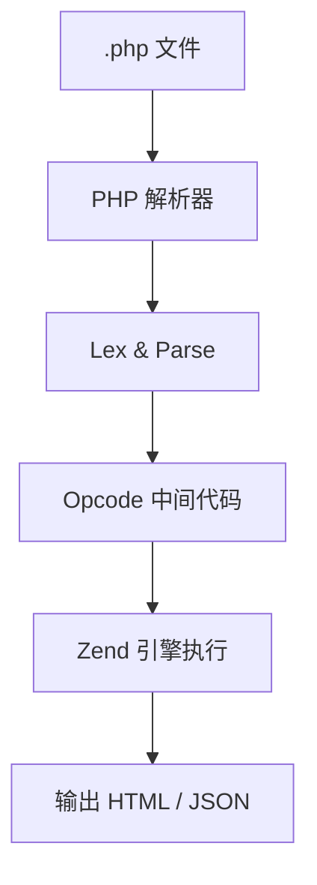

# PHP 编程语言全解：起源、语法技巧、运行机制与应用实践


 

> *“PHP 是为 Web 而生的语言，它简单高效、社区庞大，是构建网站的经典之选。”*

---

## 🧬 1. PHP 的起源与发展

PHP 全称为：**PHP: Hypertext Preprocessor（递归缩写）**

- **创建时间：** 1995 年  
- **创始人：** Rasmus Lerdorf  
- **最初用途：** 为维护个人主页编写的小工具（Personal Home Page Tools）

### 📈 演变简史：

| 年份 | 版本演进       | 特点说明                            |
|------|----------------|-------------------------------------|
| 1995 | PHP/FI         | 初始版本，嵌入 HTML 的 CGI 工具集   |
| 1998 | PHP 3.0        | 正式成型，支持函数式开发            |
| 2000 | PHP 4.0        | 引入 Zend 引擎，性能大幅提升        |
| 2004 | PHP 5.x        | 支持面向对象，集成 PDO              |
| 2015 | PHP 7.x        | 性能飞跃，标志现代 PHP 的成熟        |
| 2020 | PHP 8.x        | 支持 JIT、属性语法、联合类型等       |

---

## 💡 2. PHP 的核心语言特点

| 特性             | 描述                                       |
|------------------|--------------------------------------------|
| 专为 Web 而生     | 内置 HTTP 请求处理、HTML 嵌入能力强         |
| 脚本语言         | 文件即代码，支持快速上手、无编译运行        |
| 动态类型         | 变量无需预定义类型，使用灵活               |
| 易部署           | 无需额外服务，Web 服务器 + PHP 即可运行     |
| 丰富扩展         | 强大的函数库，数据库、图像、JSON 支持全面   |

---

## ⚙️ 3. 底层执行逻辑简析

PHP 是一种**解释性脚本语言**，运行机制如下：



从 PHP 7 起，性能大幅提升，PHP 8 引入 JIT 编译（Just-In-Time），进一步增强计算效率。

---

## ✍️ 4. PHP 常用语法与使用技巧

### ✅ 基本语法示例

```php
<?php
$name = "ChatGPT";
echo "Hello, $name!";
?>
```

### ✅ 条件与循环

```php
if ($score > 90) {
    echo "优秀";
} elseif ($score > 60) {
    echo "及格";
} else {
    echo "不及格";
}
```

```php
foreach ($users as $user) {
    echo $user['name'];
}
```

### ✅ 函数定义

```php
function add($a, $b) {
    return $a + $b;
}
```

### ✅ 类与对象

```php
class User {
    public $name;

    function __construct($name) {
        $this->name = $name;
    }

    function greet() {
        return "Hi, I’m " . $this->name;
    }
}
```

---

## 🧩 5. PHP 应用场景

| 领域           | 典型应用/框架                     |
|----------------|----------------------------------|
| 网站开发       | WordPress、Drupal、Joomla        |
| 电商平台       | Magento、WooCommerce             |
| 后端 API       | Laravel、Slim、Symfony           |
| 企业门户       | 定制 CMS、办公门户系统           |
| 博客与论坛     | Discuz、Typecho、phpBB           |

---

## 🛠 6. 主流 PHP 框架简介

| 框架      | 特点描述                                         |
|-----------|--------------------------------------------------|
| Laravel   | 现代优雅，语法简洁，生态强大，适合中大型项目     |
| Symfony   | 高度模块化，企业级项目首选                       |
| ThinkPHP  | 中文社区活跃，适合国内中小型项目                 |
| Slim      | 微框架，快速构建 RESTful API                     |
| CodeIgniter | 轻量、快速，学习成本低                         |

---

## 📘 7. 推荐学习资源

| 类型      | 名称 / 链接                                     |
|-----------|--------------------------------------------------|
| 教程      | [PHP 官方文档](https://www.php.net/manual/zh/)  |
| 视频课    | 慕课网、B站《PHP 入门/进阶》系列课程              |
| 框架学习  | [Laravel 官方教程](https://laravel.com/docs)     |
| 实战平台  | [PHP Sandbox](https://phpsandbox.io/)            |
| 社区      | PHP 中文网、Stack Overflow、Reddit r/php         |

---

## ✅ 总结一句话

> **PHP 是一门老牌、高效、面向 Web 的脚本语言，在中小网站和 CMS 生态中仍占据重要地位，配合现代框架依然能构建优雅、高效的系统。**

 